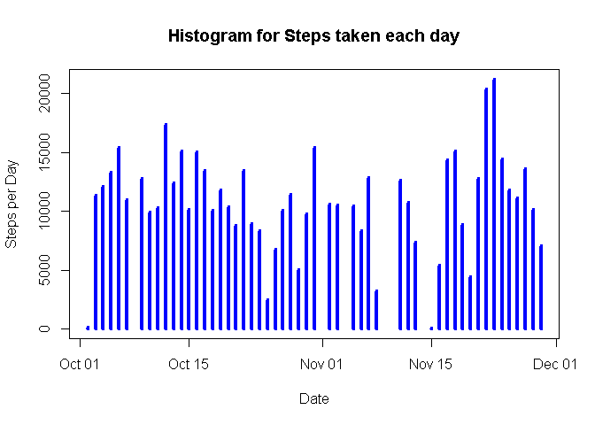
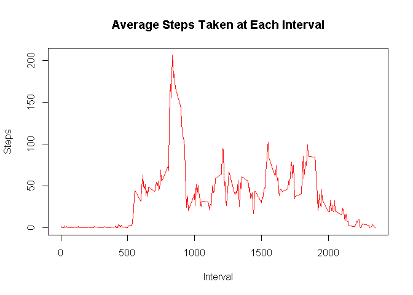
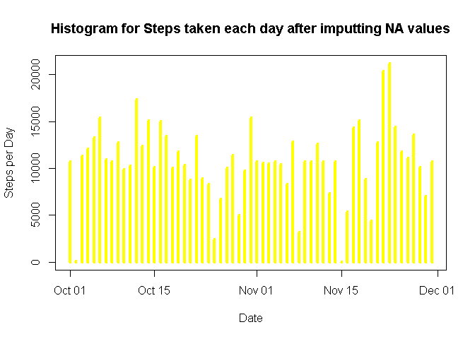
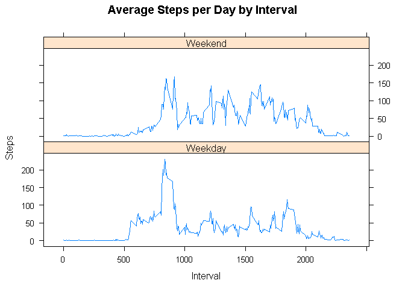

# Reproducible Research: Peer Assessment 1


## Loading and preprocessing the data
Load/Read activity.csv file into "activity" data frame

```r
activity <- read.csv("C:/Users/Pradeep/datasciencecoursera/RepData_PeerAssessment1/activity.csv")
```
Convert date field from factor to date

```r
activity$date <- as.Date(activity$date)
```

## What is mean total number of steps taken per day?
Calculate steps taken per day. Do not include NA values

```r
stepsperday <- aggregate(steps ~ date, activity, sum, na.RM = TRUE)
```
Plot histogram for total number of steps taken each day.

```r
plot(stepsperday$date, stepsperday$steps, type="h", main="Histogram for Steps taken each day", xlab="Date", ylab="Steps per Day", col="blue", lwd=4)
```

 

Calculate mean and median of steps by day

```r
paste("Mean Steps per Day =", mean(stepsperday$steps, na.rm=TRUE))
```

```
## [1] "Mean Steps per Day = 10767.1886792453"
```

```r
paste("Median Steps per Day =", median(stepsperday$steps, na.rm=TRUE))
```

```
## [1] "Median Steps per Day = 10766"
```

## What is the average daily activity pattern?
Calculate steps taken per interval across all the days. Do not include NA values.

```r
stepsperint <- aggregate(steps ~ interval, activity, mean, na.RM = TRUE)
```

Create a time series plot of average steps by interval

```r
plot(stepsperint$interval, stepsperint$steps, type="l", main="Average Steps Taken at Each Interval", xlab="Interval", ylab="Steps", col="red")
```

 


```r
#Which 5-minute interval contains the maximum number of steps?
paste("Interval with max no. of steps =", stepsperint[which.max(stepsperint$steps),1])
```

```
## [1] "Interval with max no. of steps = 835"
```

## Imputing missing values
Calculate total number of missing values from activity dataset.


```r
# Missing values for each column are
colSums(is.na(activity))
```

```
##    steps     date interval 
##     2304        0        0
```

Only column with missing values is 'steps'. These missing values are filled with the average steps taken for that interval.
Thus a new data set is created with filled in missing values. 

```r
new_data <- transform(activity, steps = ifelse(is.na(activity$steps), stepsperint$steps[match(activity$interval, stepsperint$interval)], activity$steps))
```

Calculate steps taken per day for new data set.

```r
stepsperdayN <- aggregate(steps ~ date, new_data, sum)
```
Plot histogram for total number of steps taken each day for new data set.

```r
plot(stepsperdayN$date, stepsperdayN$steps, type="h", main="Histogram for Steps taken each day after imputting NA values", xlab="Date", ylab="Steps per Day", col="yellow", lwd=4)
```

 

Calculate mean and median of steps by day for new data set.

```r
paste("Mean Steps per Day =", mean(stepsperdayN$steps))
```

```
## [1] "Mean Steps per Day = 10766.1886792453"
```

```r
paste("Median Steps per Day =", median(stepsperdayN$steps))
```

```
## [1] "Median Steps per Day = 10766.1886792453"
```

There is no difference in the mean and median after imputting the missing values.
This is because, we are using average steps taken for the interval to replace the missing values,
which is not going to change the average of the variable under consideration.

## Are there differences in activity patterns between weekdays and weekends?
Create a factor variable in the dataset with two levels - "weekday" and "weekend" indicating whether a given date is a weekday or weekend day.

```r
weekdays <- c("Monday", "Tuesday", "Wednesday", "Thursday", "Friday")
new_data$dow = as.factor(ifelse(is.element(weekdays(as.Date(new_data$date)),weekdays), "Weekday", "Weekend"))
```

Calculate average steps taken per interval with respect to day of the week.


```r
stepsperintD <- aggregate(steps ~ interval + dow, new_data, mean)
```

Create a panel plot containing a time series plot of the 5-minute interval (x-axis) and the average number of steps taken, averaged across all weekday days or weekend days (y-axis).


```r
library(lattice)

xyplot(stepsperintD$steps ~ stepsperintD$interval|stepsperintD$dow, main="Average Steps per Day by Interval",xlab="Interval", ylab="Steps",layout=c(1,2), type="l")
```

 
